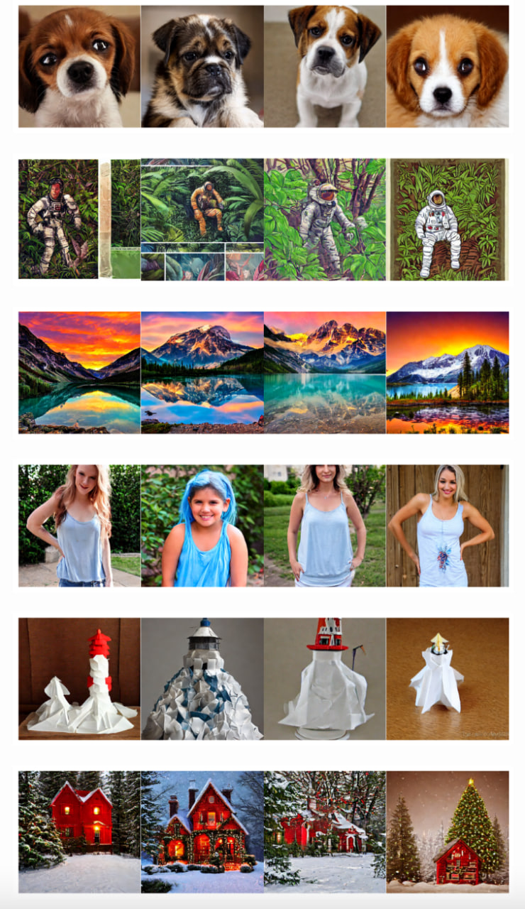
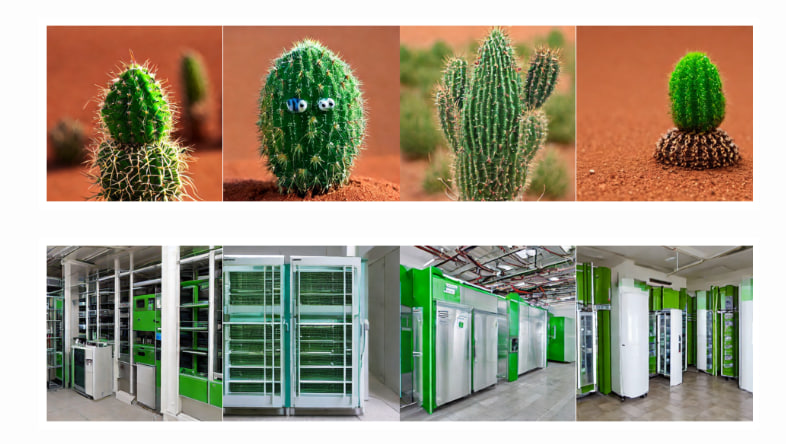

- Главная страница курса: https://shad.yandex.ru/cvweek
- Моя модель на Hugging Face: https://huggingface.co/ke-jetronic/cv_week_final_task
- Ссылка на transposed_mnist_test.pt и transposed_mnist_train.pt (не влезли в репозиторий GitHub, посмотреть путь можно в файле gitignore): https://disk.yandex.ru/d/suD8f0HUAp9rQg

.png)

---

Пример работы:
1. Грустный щенок с большими глазами
2. Астронавт в джунглях, холодная цветовая палитра, приглушенные цвета, детализация, 8k
3. Фотография красивой горы с реалистичным закатом и голубым озером, очень детализированная, шедевр
4. Девушка с бледно-голубыми волосами и в майке-батисте
5. Маяк на гигантской волне, в стиле оригами
6. Прекрасная эпоха, Рождество, красный домик в лесу, фотореалистичный, 8k
7. Маленький кактус со счастливым личиком в пустыне Сахара
8. Экологичное коммерческое здание с холодильником и холодильными установками снаружи

